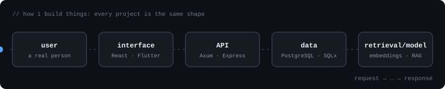

  

  

  
  

  

### Selected work

| Project | What it does | Pipeline |
|---|---|---|
| [WebInventory](https://github.com/yosephfetene/WebInventory) | Full-stack inventory management app (React, Express, JWT auth) | `request → middleware → auth → handler → DB` |
| [EPL RAG](https://github.com/yosephfetene/AI-RAG-Ethiopian-Premiere-League) | Q&A over Ethiopian Premier League data | `ingest → embed → retrieve → generate` |
| [PDF Scribe](https://github.com/yosephfetene/pdf-scribe) | Turns scanned PDFs into structured text | `PDF → OCR → clean → structure` |
| [Studio Workstation](https://github.com/yosephfetene/Studio-Workstation) | Audio workstation | `events → state → audio` |

### Stack

  

### GitHub

  
  

